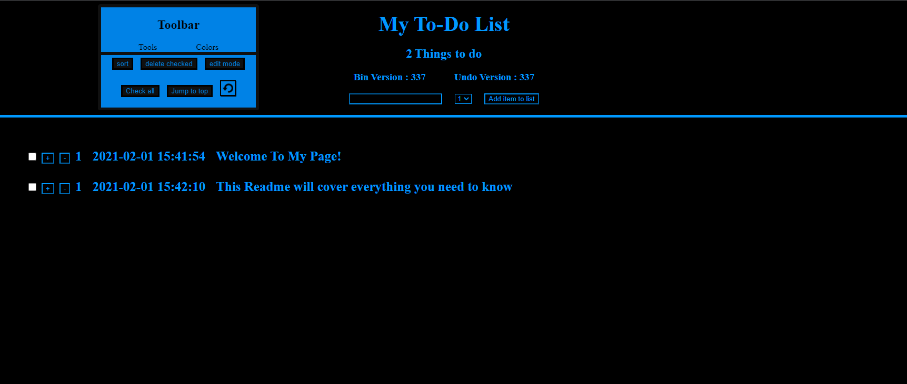

GitHub-pages Link:
file:///C:/Users/USER/Documents/GitHub/pre-course-2021-final-boilerplate/src/index.html

Link to the site that helped with the drag&drop option.
https://javascript.info/mouse-drag-and-drop

 

My todo-list final project

In this readme i will explain about my project.

first i created the html file where i added all the basics and created the main elements i will work with in my JS code.
After all the basics were finished i moved on to the JS code where i began work on the actual project.

JS functions:
-addElements()
    This function creates all the elements that need to be inside a todo container, adds them a class and later on appends them
    to the container. inside this function i created two event listeners that change the priority of the current todo-container and
    assigned them to the increase and decrease priority buttons inside the container. After the container is done, he is being appended to
    the view section and increases the counter.

-assignValues(container,priority,date,text)
    This function gets a container and all the necessary values that needs to be inside it and assigns them into it's elements.
    After the container is complete the function resets the text-input and adds class according to the priority via a function i will acknowledge later.

-addToList(){
    This function uses both of the function above to add a todo-container to the view-section and into the JSON.bin and is being assigned 
    to the add-button as an eventListener.

-convertTimeFormat(date)
    This function gets a date as an argument to slice and modify it to an SQL format.

-counterChange()
    This function updates the counter to match the amount of todo-containers inside the view section and changing its following text.

-prioritize()
    This function sorts the view section by priority in descending order and is assigned to the sort button as an eventListener.

-priorityClass()
    This function sets a class for the container depending on its priority.

-checked()
    This function adds a "checked" style to all the containers with a checked checkbox

-deleteClass(className)
    This function deletes all the containers with a certain class name or the checked class if no class name is given. this function is assigned to
    the delete button as an eventListener

-checkAll()
    This function checks all the checkboxes in the view section. Assigned to the checkAllButton.

-edit()
    The edit function has two phases. When you first click the edit button its text changes to "save" and all the todo-texts are converted into
    text inputs that allows you to edit their content. when the client is done editing, he can press the editButton again which now says "save" and save your editing,
    and changes the time of the edited lines to the time the client saved. In addition, it deletes all the lines that have a blank text using the deleteClass function.

Next is the toolbar which can be dragged and stay in a fixed position inside the borders of the window to the client convenience. inside the toolbar there are 3 different
divs. The first is the title, which is the only part that will trigger the dragging function. Inside, there are 2 labels that represent the other divs inside the toolbar
that collapse and expand by clicking on them.
The second div is the tools div which contains most of the tools and buttons of the project.
The third div is the colors div that contains all the colors that are used in the project and enables the client to mess with the colors of the elements
at his will using functions i will describe later.

-getColors()
    This function happens on the first time the window is loaded to get the colors of the css variables used in the stylesheet and insert them into the
    color inputs in the color div inside the toolbar. in addition the function adds an onchange eventListener to all the inputs to change the colors of 
    the css variables to match them whenever they are changed.

-hide(div)+show(div)
    These functions get a div as an argument and are triggered when the client clicks the labels in the toolbar title. These functions
    expand or collapse the given div according to the label the client clicked on.

-the local storage section is commented because there was no need to use it after the data transfer to JSON.bin.

JSON-bin

-put()
    This function gets a list of containers and converting it to an array of items with the priorities of test,date,property and checkbox then sending that array inside
    an object called "my-todo" and a number which is the current version of the bin inside an object called "version" to the bin.

-get()
    This function receives the info from the bin assigns the "my-todo" object into an array and the version into the currentVersion variable. It proceeds to 
    call the functions createElements and assignValues to add the items from the array to the viewSection, and resets the undo counter which we will get to later.

-loadBin()
    This function does all the things that are needed when launching the window like getting the colors, getting the info from the bin and translating it to
    elements and assigning the undo counter and currentVersion.

-undoBin()
    This function allows the client to undo changes by going back to previous versions of the bin without loosing progress of their list.
    First, it resets all the view-section, and then it gets the information from the previous(or earlier if clicked more times) version of the same bin.
    It also changes the undo counter the displays it on the screen so the client will know where he is at all times.

